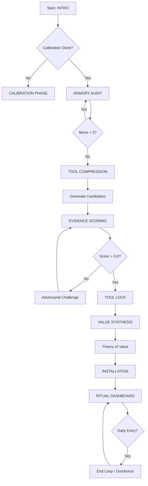
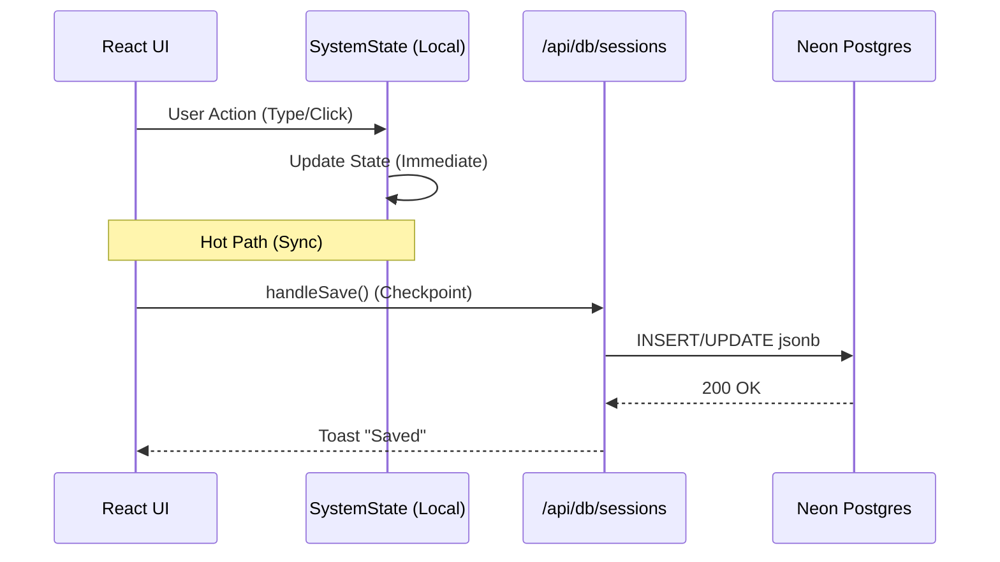

# Sovereign Logic Map (Mermaid)

## 1. The Autopoietic Loop (Core Gameplay)


## 2. World Forge Logic (Tier 5)
```mermaid
graph TD
    A[Ritual Dashboard] --> B{Active Tool Locked?}
    B -- No --> C[Greyed Out]
    B -- Yes --> D[Click 'World Forge']
    
    D --> E[Select Archetype]
    E --> F[Generate Scenario (AI)]
    F --> G[Run Simulation]
    
    G --> H{Score > 70?}
    H -- No --> I[Fail: +10 XP (Effort)]
    H -- Yes --> J[Pass: +60 XP (Victory)]
    
    J --> K[Update SystemState.simulationHistory]
    K --> L[Unlock 'Sovereign' Rank Potential]
```

## 3. Data Persistence Flow

